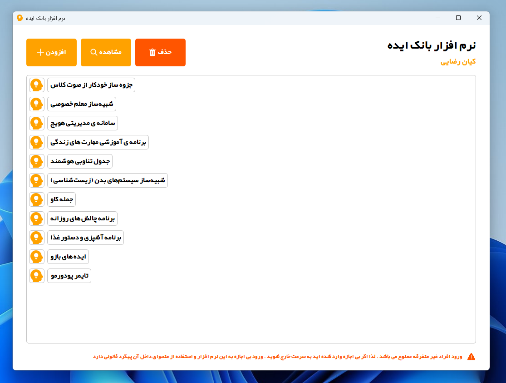

# Idea Bank - Manage Your Ideas
Hi Guys . Today I Created a Managing Software For My Ideas . I Have Planed To Make It Privately . But Now I Think It Can Be UseFull For AnyBody . Sorry If My Name Is In App And Login . You Can Modify It Esely . I Try To Fix It

### Application Login Password : 1390
It Was A Application For Practice Pyqt5 , Python And Python Sqlite Connection

If You Modify Code For Your Self You Can Export Executable File With This Pyinstaller Command Esely

`pyinstaller --onefile --windowed --icon=logo.ico main_ui.py`

### Todo
- [ ] Make Signup System For New Users
- [ ] Dont Let Windows Scale 
- [ ] Password Changing System
- [ ] Add Other Languages
